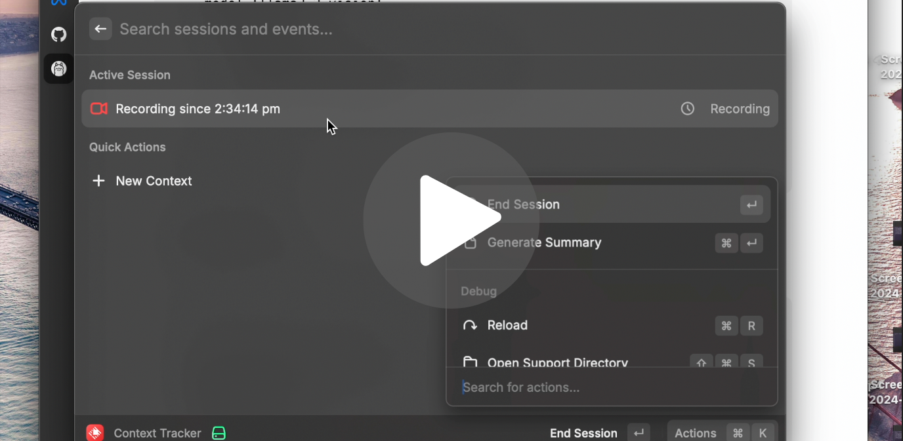

# Raycast Plugin: Context-Tracker

[](https://youtu.be/CuOoXqdsD_w?si=nCknNQvhwroWAdGf)


|| [Blog Post](https://open.substack.com/pub/ashwinmirskar/p/context-tracker-ai?r=b1eef&utm_campaign=post&utm_medium=web) || [Demo Video](https://youtu.be/CuOoXqdsD_w?si=nCknNQvhwroWAdGf) ||

## Overview

Context-Tracker is a Raycast plugin designed to help you track and manage your development contexts efficiently. It allows you to create, start, and end sessions, generate summaries, and keep track of session events. See [here](https://github.com/Pythonista7/context-tracker-backend) for the api server.

## Features

- **Create Contexts**: Easily create new contexts with a name and description.
- **Start and End Sessions**: Start a new session within a context and end it when done.
- **Session Events**: Track events that occur during a session.
- **Generate Summaries**: Automatically generate summaries for your sessions.
- **Quick Actions**: Access quick actions from the menu bar. (PS: Still a bit buggy.)

## Installation

1. Clone the repository:
    ```sh
    git clone 
    cd context-tracker
    ```

2. Install dependencies:
    ```sh
    npm install
    ```

3. Build the project:
    ```sh
    npm run build
    ```

4. Start the development server:
    ```sh
    npm run dev
    ```

## Usage

### Creating a Context

1. Open the Raycast command palette.
2. Select "New Context".
3. Fill in the context name and description, then submit.

### Starting a Session

1. Open the Raycast command palette.
2. Select a context from the list by double clicking on it to start recording.

### Generating a Summary

1. Open the Raycast command palette.
2. Right Click on the currently "Recording" item and Select "Generate Summary".

### Ending a Session

1. Open the Raycast command palette.
2. Right Click on the currently "Recording" item and Select "End Session".

## Contributing
Contributions are welcome! Please open an issue or submit a pull request.